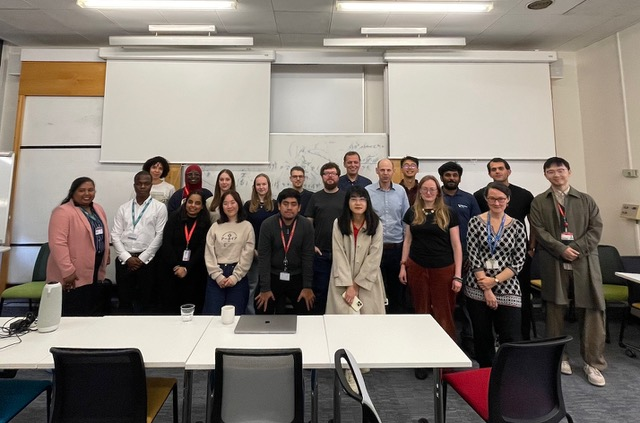

## Outline

- Who are we and why are we talking about this (~3 mins)
- Why EDIA matters (~5 mins)
- Challenges and (towards) solutions (~12 mins)
- Key takeaways (~5 mins)
- Q&A (~5 mins)

# Who are we and why are we talking to you about EDIA? {.center-h}

# Why EDIA matters for RSEs {.center-h}

## Background {.smaller90}

:::: {.columns .smaller80}
Diversity within the RSE community:

::: {.column width="20%"}
**Gender1**:
:::

::: {.column width="80%" .smaller90}
| RSEs | Male | Female | Prefer to self-describe |
|---|---|---|---|---|
| UK | 71% | 20% | 3% |
| USA |  78% | 18% | 2% |
| Germany | 85% | 13% | 1% |
| World  | 80% | 16% | 1% |
::: {.smaller50}
Figures rounded to nearest percentage point. Individual countries included
where respondent count > 100. The 2022 RSE survey provides insufficient data to be able to report on other
aspects of diversity.
:::

:::

::::

::: {.smaller70}
<b>In the 2018 International RSE survey, results for the UK showed 79.8%
of respondents as male, 14.3% female and 0.5% selecting the "other"
option2.</b>

For comparison, from 2021 UK Census results for England and Wales, males
represented 52% and females of 48% of all those in employment 3.
:::

::: aside
::: {.smaller50}
1 Data from the RSE International Survey 2022: S. Hettrick et al. 
Sociodemography section, “RSE Survey 2022”, Version 2022-v0.9.0. DOI: <https://doi.org/10.5281/zenodo.6884882>.

2 Data from the RSE International Survey 2018: O. Philippe et al.,
Public release for 2018 results, Version 2018-v.1.0.2. DOI:
<http://doi.org/10.5281/zenodo.2585783>

3 Office for National Statistics (ONS), released 25 September 2023, ONS website, article, [Diversity in the labour market, England, and Wales: Census 2021](https://www.ons.gov.uk/employmentandlabourmarket/peopleinwork/employmentandemployeetypes/articles/diversityinthelabourmarketenglandandwales/census2021)
:::
:::

## Background: Skill and career pipelines {.smaller90}

- Effective skill and career pipelines vital to build a more diverse community
- Enhancing technical skill development opportunities in schools and at undergraduate level (in traditionally non-computational domains)

## But we can also make a difference within the existing community...

- "**Domain mobility**"1 - shows precedent for moving between domains to undertake RSE work - demographics can differ between subject areas.

- Data (e.g. 2022 RSE international survey 2) shows many
RSEs currently undertaking technical work in a different domain to that of
their highest-level qualification.

::: aside
::: {.smaller50}
1 N. P. Chue Hong, J. Cohen, C. Jay, (2021). Understanding Equity, Diversity
and Inclusion Challenges Within the Research Software Community. In: Paszynski,
M. et al.(eds) ICCS 2021. LNCS, vol 12747. Springer, Cham.
<https://doi.org/10.1007/978-3-030-77980-1_30>

2 Data from the RSE International Survey 2022: S. Hettrick et al. 
Sociodemography section, “RSE Survey 2022”, Version 2022-v0.9.0. DOI: <https://doi.org/10.5281/zenodo.6884882>.
:::
:::

# Challenges and (towards) solutions

## STEP-UP Research Technical Champions scheme {.nostretch .smaller70}

:::{.center-h}
{width=600px}
:::

The STEP-UP Research Technical Champions scheme supports a group of PhD
students from the STEP-UP partner institutions to help their peers to develop
new technical skills and address technical challenges in their research.

## R Project Sprint

:::{.center-h}

:::

::: {.smaller80}
R Project Sprints bring together a diverse group from around the world for three days to make substative contributions to base R.
:::

## Key take-aways

- EDIA matters
- We can all play a role in creating diverse, inclusive and sustainable communities
- Opportunities exist to make a difference - don't be frightened to engage!
- Community only happens when people create the spaces and folks participate

## Links 

- STEP-UP: <https://step-up.ac.uk>
  - STEP-UP Mentoring Scheme: <https://step-up.ac.uk/mentoring/>
  - STEP-UP Placement Scheme: <https://step-up.ac.uk/placements/>
- R Contributors: <https://contributor.r-project.org>
- rainbowR: <https://rainbowr.org>

## Papers

- Papers
  - N. P. Chue Hong, J. Cohen, C. Jay. Understanding Equity, Diversity and Inclusion Challenges Within the Research
Software Community (2021). ICCS 2021, LNCS vol 12747. Springer, Cham. <https://doi.org/10.1007/978-3-030-77980-1_30>
  - M. Tenquist et al., "Recommendations for Developing Effective Inclusivity
Initiatives in Research Software Engineering" in Computing in Science &
Engineering, vol. 27, no. 02, pp. 35-44, April-June 2025.
<https://doi.org/10.1109/MCSE.2025.3539076>.

# Thank you {.center-h .larger150}
 

::: {.center-h .larger150}

What are your questions?

:::

::: {.smaller50 .funding-footer}

JC acknowledges support from the STEP-UP project under UKRI EPSRC grant
EP/Y530608/1.

:::