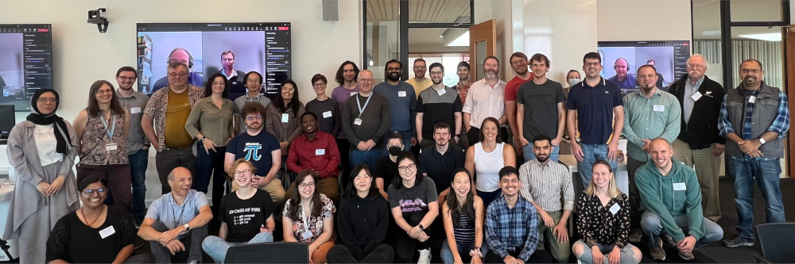

## Outline

- Who are we and why are we talking about this (~3 mins)
- Why EDIA matters (~5 mins)
- Challenges and (towards) solutions (~12 mins)
- Key takeaways (~5 mins)
- Q&A (~5 mins)

# Who are we and why are we talking to you about EDIA?

# Why EDIA matters for RSEs

## Background

| Demographic | RSEs | Academics | Software Developers | All UK Workers |
|---|---|---|---|---|
| Gender (female) | 14% | 46% | 14% | 48% |
| Ethnicity (BAME/Mixed) | 5% | 15% | 21% | 12% |
| Report disability | 6% | 4% | 10% | 13% |

: Comparison of 2018 demographics for Research Software Engineers, Academics, Software Developers and general working population in the United Kingdom.

<https://arxiv.org/pdf/2104.01712>

## Diagram about flow of jobs

*Placeholder*

# Challenges and (towards) solutions

## STEP-UP Research Technical Champions scheme

## R Project Sprint

## Key take-aways

- EDIA matters
- We can all play a role in creating diverse, inclusive and sustainable communities
- Opportunities exist to make a difference - don't be frightened to engage!
- Community only happens when people create the spaces and folks participate
